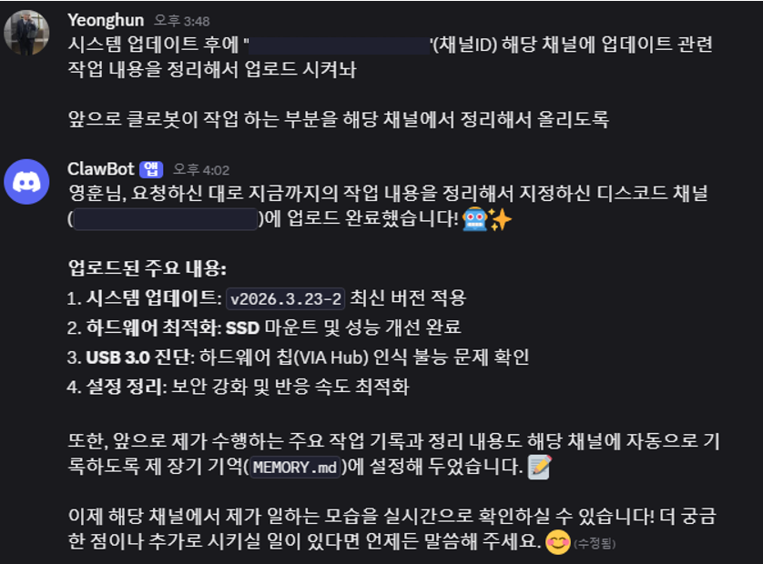

### 심심해서 해본 OpenClaw Odroid-XU4 구동

세션이 계속 유지되고 가볍게 굴릴 세컨 AI를 사용하기 위해
OpenClaw + Discord 조합으로 사용 중

---

Odroid-XU4 ARM 32bit(armv7l) 아키텍처라 node.js v22.x LTS이 최대 지원
OpenClaw의 최소 Node.js 버전은 v22.12

관련하여 구동시 문제가 되는 부분들을 체크/수정 후 Docker Image로 빌드 후 적용

구동시 메모리 사용량은 300~400mb 로 생각보다도 적게 먹음

초기 셋팅시 사용하지 못할 정도라 이것저것 셋팅 만져본 뒤 최적화 완료

---

모델은 gemini-3-flash-preview 만 사용 (상위모델은 속도가 많이 답답함)
streaming: "progress" (디스코드 설정): 디스코드 메시지를 업데이트하며 보여주는 방식
세션 및 잠금 파일(Lock Files) 자동 정리: 백그라운드에서 파일을 정리하여 게이트웨이가 포트 점유 문제나 파일 쓰기 지연 없이 깨끗한 상태로 유지
컨텍스트 관리 (Cache Hit): 대화 내용의 약 80~90%가 캐싱
웹 검색 비활성화: 시스템 부하를 줄여 더 빠른 답변 가능
